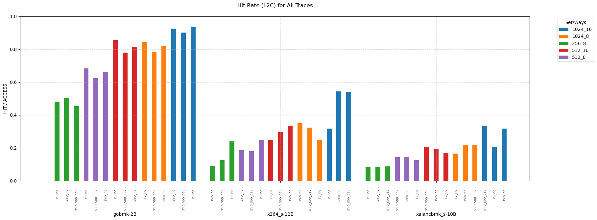
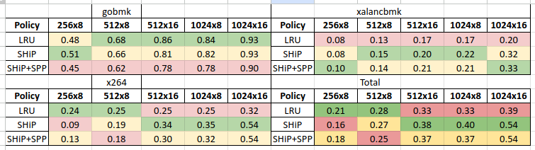

# Политики замещения

## LRU

Простая, но эффективная политика. Новый элемент при промахе заменяет самый давноиспользуемый элемент.

Современные процессоры используют вариации LRU, т.к. аппаратная реализация идеального LRU затратна и, вообще говоря, не сильно и нужна.

В процессорах Intel для L1 Data Cache чаще всего применяют деревообразный псевдо‑LRU (Tree‑PLRU).

Для L2 же обычно используют QLRU. Это семейство алгоритмов, в которых для каждого way'a хранится 2-битовый счетчик, который, в зависимости от спецификации алгоритма, решает, какой элемент считать LRU.

Для L3 Intel внедряет адаптивный подход: часть set'ов используют тот же QLRU, что и L2 (например, сеты 0, 33, 132,...),
а остальные динамически переключаются между L2 QLRU и некоторым другим QLRU для лучшей производительности

Например, для Intel Ice Lake (2020). [Источник](https://uops.info/cache.html#ICL)

L1: 
- Size: 48 kB
- Associativity: 12
- Number of sets: 64
- Way size: 4 kB
- Latency: 5 cycles
- Replacement policy: Модифицированный PLRU (3 дерева по 4 ways)

L2:
- Size: 512 kB
- Associativity: 8
- Number of sets: 1024
- Way size: 64 kB
- Latency: 13 cycles
- Replacement policy: QLRU (QLRU_H00_M1_R0_U1)

L3:
- Size: 6 MB
- Associativity: 12
- Number of CBoxes: 4
- Number of slices: 8
- Number of sets (per slice): 1024
- Way size (per slice): 64 kB
- Latency: 41 cycles
- Replacement policy: Adaptive

## SHiP (Signature‑based Hit Predictor)

SHiP — политика замещения, которая при вставке учитывает сигнатуру инструкции (например, адрес команды, вызвавшей загрузку).
Для каждой уникальной сигнатуры поддержится 2‑битовый счётчик: он увеличивается, если строки с этой сигнатурой действительно повторно обращаются, и уменьшается, если нет.
При новом попадании в кэш строка с худшей сигнатурой будет вытеснена.

Политика SHiP в процессорах Intel не задокументирована и, судя по доступным источникам, не используется

## SPP (Signature Path Prefetcher)

SPP — алгоритм хардварного префетчинга, который строит сигнатуру последовательности stride'ов внутри страницы и на её основе предсказывает следующие адреса.
При доступе к строке SPP обновляет для текущей страницы 12‑битную историю, индексирует по ней таблицу шаблонов и выбирает несколько наиболее вероятных будущих смещений для префетчинга

Аналогично, никакой информации об использовании SPP на практике я не нашел.

# Результаты

### **Test 1: gobmk**
| **Policy**   | **256x8**  | **512x8**  | **512x16** | **1024x8** | **1024x16** |
|--------------|------------|------------|------------|------------|-------------|
| **LRU**      | 0.48       | 0.68       | 0.86       | 0.84       | 0.93        |
| **SHiP**     | 0.51       | 0.66       | 0.81       | 0.82       | 0.93        |
| **SHiP+SPP** | 0.45       | 0.62       | 0.78       | 0.78       | 0.90        |

---

### **Test 2: x264**
| **Policy**   | **256x8**  | **512x8**  | **512x16** | **1024x8** | **1024x16** |
|--------------|------------|------------|------------|------------|-------------|
| **LRU**      | 0.24       | 0.25       | 0.25       | 0.25       | 0.32        |
| **SHiP**     | 0.09       | 0.19       | 0.34       | 0.35       | 0.54        |
| **SHiP+SPP** | 0.13       | 0.18       | 0.30       | 0.32       | 0.54        |

---

### **Test 3: xalancbmk**
| **Policy**   | **256x8**  | **512x8**  | **512x16** | **1024x8** | **1024x16** |
|--------------|------------|------------|------------|------------|-------------|
| **LRU**      | 0.084      | 0.13       | 0.17       | 0.17       | 0.20        |
| **SHiP**     | 0.084      | 0.15       | 0.20       | 0.22       | 0.32        |
| **SHiP+SPP** | 0.098      | 0.14       | 0.21       | 0.21       | 0.33        |

### **Total (Geomean)**
| **Policy**   | **256x8** | **512x8** | **512x16** | **1024x8** | **1024x16** |
|--------------|-----------|-----------|------------|------------|-------------|
| LRU          | 0.21      | 0.28      | 0.33       | 0.33       | 0.39        |
| SHiP         | 0.16      | 0.27      | 0.38       | 0.40       | 0.54        |
| SHiP+SPP     | 0.18      | 0.25      | 0.37       | 0.37       | 0.54        |

---

## LRU vs SHIP

Как видно из таблицы, однозначный ответ получить сложно. LRU показывает себя лучше на меньших размерах кеша, а SHiP на больших.
LRU показывает себя лучше на тестах с бОльшим hitrate'ом, а SHiP наоборот.

Рассмотрим 1024x8, на нём SHiP значительно опережает LRU (40% vs 33%).

## SPP vs no SPP

Ни в одном из тестов SPP не показал существенный буст hitrate'а. В первых двух тестах он только упал, а в 3м почти не изменился.

Отсутствие улучшений от SPP объясняется, вероятно, сложными паттернами обращений в память в тестах 

Для 1024x8, включение SPP ухудашает результат на 3%.

## Какой размер кеша "достаточный"

Достаточный размер выявлен не был. При последнем скачке размера кеша в 2 раза LRU получил дополнительные 9%, а SHiP 14% hitrate'а.

А учитывая, что в современных процессорах кеши могут занимать до трети площади кристалла, этот размер будет достигнут еще не скоро =)

## Set vs Way

Рассмотрим 512x16 vs 1024x8.
Обычно, L2 кеш обладает небольшой ассоциативностью, поэтому интуитивно кажется, что второй вариант должен выиграть. 

На тестах результаты почти идентичны (в пределах 1-2%), поэтому победителем будет 1024x8, т.к. под него потребуется меньше площади.
